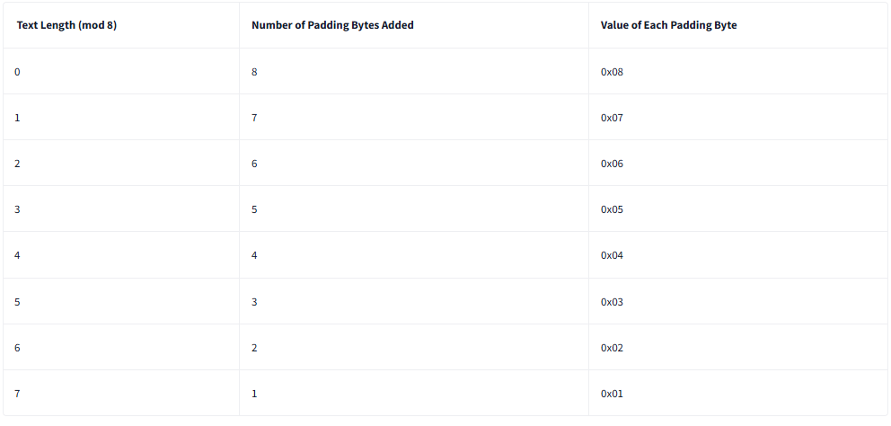
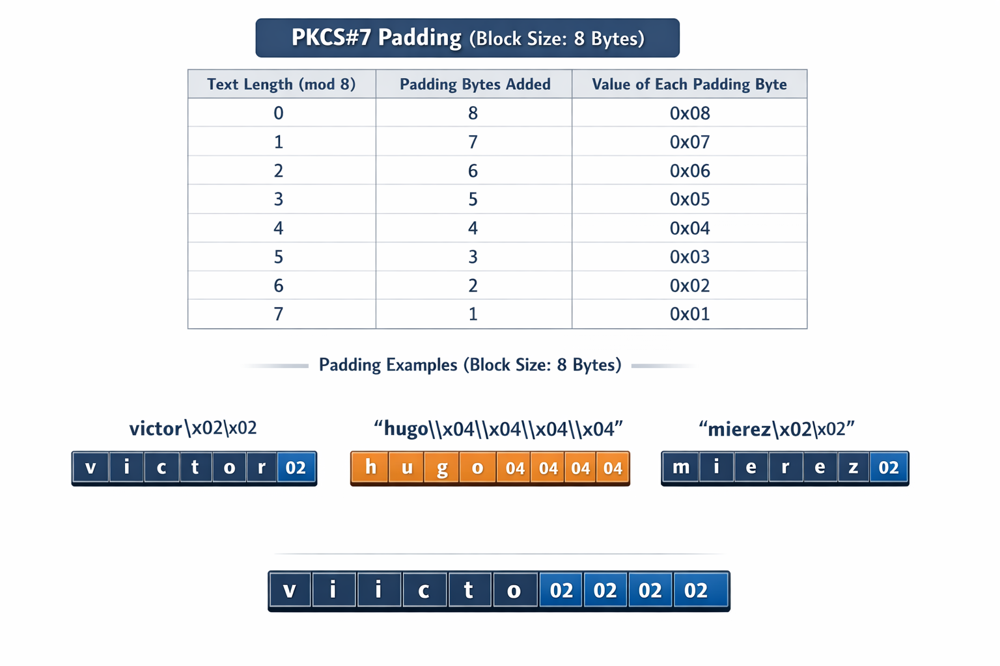
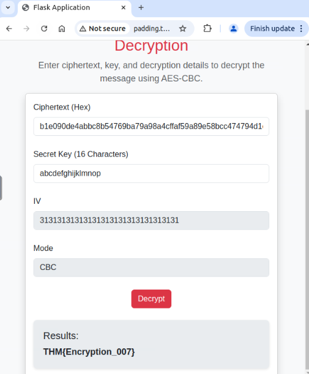

# Introduction

Encryption is essential for maintaining data security, but even robust encryption can fail if it is not implemented correctly. One example is the ‘Padding Oracle’ attack, a vulnerability that exploits the way encrypted data is processed, particularly when padding is used.

‘Padding Oracle’ attacks occur when an application reveals whether the padding of the encrypted data is correct or not through detailed error messages or variations in response time. Attackers can exploit these subtle clues to deduce the original data without the encryption key. This attack targets encryption methods such as Cipher Block Chaining (CBC), which uses padding to handle data of varying lengths. The ‘Padding Oracle’ attack is so named because the server acts as an ‘oracle’ by providing information on whether the padding in the ciphertext is valid.
Learning Objectives
Throughout this session, you will gain a comprehensive understanding of the following key concepts:

    Padding schemes
    Block cipher modes
    Encryption and decryption mechanisms
    How does the padding oracle attack work?
    Automation mechanisms
    Mitigation and best practices

## Block Ciphers and PKCS#7 Padding

- Block Ciphers: Algorithms such as AES operate on fixed‑size blocks (e.g. 16 bytes). If the plaintext is longer, it is split into blocks; if shorter, padding is added.

- Chaining Modes: Since encryption involves multiple blocks, methods like Cipher Block Chaining (CBC) are used to link them securely.

- Padding: Ensures plaintext fits the block size. Without proper padding, decryption errors or vulnerabilities can occur.

Schemes: Common padding schemes include PKCS#7, ANSI X.923, and ISO/IEC 7816‑4.

PKCS#7:

- Adds bytes where each padding byte’s value equals the number of padding bytes added.

- If the plaintext already matches the block size, an extra block of padding is appended, filled with the block size value.

Example (block size = 8):

- Plaintext length mod 8 = 5 → 3 padding bytes added.

- Each padding byte has value 0x03.

- Final block ends with ...030303.

## PKCS#7 Padding (Block Size = 8)
Concept
Block ciphers such as AES require each block to be of a fixed size (in this case, 8 bytes).

If the plaintext is shorter than this size, padding bytes are added.

Each padding byte has a value equal to the number of bytes added.

If the text is already a multiple of the block size, a full block of padding is added.

Reference table:




### Practical examples
- Message: ‘victor’

Length = 6 bytes → 6 mod 8 = 6

2 bytes of padding are added → 0x02 0x02

Result: victor\x02\x02

- Message: ‘hugo’

Length = 4 bytes → 4 mod 8 = 4

4 padding bytes are added → 0x04 0x04 0x04 0x04

Result: hugo\x04\x04\x04\x04

- Message: ‘mierez’

Length = 6 bytes → 6 mod 8 = 6

2 bytes of padding are added → 0x02 0x02

Result: mierez\x02\x02

- Each message is independently adjusted to the 8-byte block size, ensuring it can be correctly encrypted using AES or another block cipher.




# Modes of Operation in Block Ciphers
Block ciphers such as AES encrypt data in fixed‑size chunks (blocks). Since plaintext rarely aligns perfectly with block boundaries, and encrypting blocks independently can expose patterns, modes of operation were developed. These modes define how blocks are processed and linked to achieve confidentiality and integrity.

--- 

1. Electronic Codebook (ECB)
- How it works: Each plaintext block is encrypted independently.

- Weakness: Identical plaintext blocks produce identical ciphertext blocks, revealing patterns.

-  Example:

    - Plaintext: ATTACK ATTACK

    - Ciphertext (ECB): [C1][C1] → repetition visible.

- Use case: Rarely recommended, sometimes used for small, random data (e.g. keys).

2. Cipher Block Chaining (CBC)
- How it works: Each plaintext block is XORed with the previous ciphertext block before encryption. The first block uses an Initialisation Vector (IV).

- Strength: Identical plaintext blocks encrypt differently if their positions or IVs differ.

- Example:

    - Plaintext: ATTACK ATTACK

    - Ciphertext (CBC): [C1][C2] → no repetition visible.

- Use case: Secure file encryption, provided IVs are random and padding is handled correctly.

3. Counter (CTR) Mode
- How it works: A counter value combined with a nonce is encrypted, and the result is XORed with the plaintext. Each block uses a unique counter, so blocks are independent but secure.

- Strength: Fast, parallelisable, and avoids the need for padding.

- Example:

    - Counter values: CTR1, CTR2

    - Ciphertext: [C1][C2] → each block unique due to counter.

- Use case: High‑performance applications such as network encryption (TLS, VPNs).

### Key Takeaway
- ECB: Simple but insecure for patterns.

- CBC: Secure chaining with IVs, widely used.

- CTR: Efficient, parallelisable, and padding‑free.


## Cipher Block Chaining (CBC) Mode
CBC is a widely used encryption mode that secures plaintext by combining each block with the previous ciphertext block before encryption. This chaining introduces randomness and ensures that identical plaintext blocks produce different ciphertexts depending on their position and the Initialisation Vector (IV).

### How Encryption Works in CBC Mode
Plaintext: "victorhugo"  
Block size: 8 bytes → split into two blocks:

Block 1: "victorhu"

Block 2: "go" + padding (0x06 × 6) → "go\x06\x06\x06\x06\x06\x06"

- Step 1: Initialisation Vector (IV)
A random IV of 8 bytes is generated.

Block 1 is XORed with the IV before encryption.

This ensures the first ciphertext block is unique even if the plaintext repeats.

- Step 2: Encrypt Block 1
Result of Plaintext Block 1 ⊕ IV is encrypted with AES.

Output = Ciphertext Block 1 (C1).

- Step 3: Chain Block 2
Block 2 ("go\x06...") is XORed with Ciphertext Block 1 (C1).

This links the second block to the first, preventing repetition patterns.

- Step 4: Encrypt Block 2
Result of Plaintext Block 2 ⊕ C1 is encrypted with AES.

Output = Ciphertext Block 2 (C2).

```
Plaintext:  victorhu | go\x06\x06\x06\x06\x06\x06
IV:         random8
Step 1:     victorhu ⊕ IV → Encrypt → C1
Step 2:     (go+padding) ⊕ C1 → Encrypt → C2
Ciphertext: C1 | C2
```
### Key Points
IV ensures randomness in the first block.

Chaining prevents patterns across identical plaintext blocks.

Padding ensures each block fits the required size.

CBC is secure if IVs are random and never reused.


## CBC Mode Example – "victorhugo"
- Step 1: Initialisation Vector (IV) and Splitting
Plaintext length = 10 characters.

Block size = 8 bytes → split into two blocks:

- Block 1: "victorhu" (8 bytes, no padding).

- Block 2: "go" (2 bytes) + 6 bytes of padding (\x06) → "go\x06\x06\x06\x06\x06\x06".

IV chosen: 01 01 01 01 01 01 01 01.

## Step 2: XOR Block 1 with IV
Block 1 hex: 76 69 63 74 6F 72 68 75.

- XOR with IV:

```
76 69 63 74 6F 72 68 75
```

⊕ 01 01 01 01 01 01 01 01
= 77 68 62 75 6E 73 69 74

```
Código
- This intermediate value introduces randomness.

---

### Step 3: Encrypt the XOR Result
- Encrypt `77 68 62 75 6E 73 69 74` with AES/DES and secret key.  
- Output = Ciphertext Block 1 (`C1`): e.g. `A3 3C 9F 12 58 44 76 10`.  
- `C1` now acts as the IV for the next block.

---

### Step 4: XOR and Encrypt Block 2
- Block 2 hex: `67 6F 06 06 06 06 06 06`.  
- XOR with `C1`:  
```

67 6F 06 06 06 06 06 06
⊕ A3 3C 9F 12 58 44 76 10
= C4 53 99 14 5E 42 70 16

```
Código
- Encrypt result → Ciphertext Block 2 (`C2`): e.g. `B7 9F 2D 5A 11 66 4F 7A`.

---

###  Final Ciphertext
The encrypted message is the concatenation of both blocks: 
```

C1 | C2
= A3 3C 9F 12 58 44 76 10 | B7 9F 2D 5A 11 66 4F 7A

```

---

###  Key Insight
- The **IV** ensures randomness in the first block.  
- Each ciphertext block depends on both its plaintext and the previous ciphertext.  
- Padding ensures the final block fits the required size.  
- CBC prevents visible patterns, even if the same plaintext is encrypted multiple times.

---

¿Quieres que te prepare un **diagrama visual** mostrando el flujo (IV → Block 1 → C1 → Block 2 → C2) para que lo uses en tu documentación de laboratorio?
```


# CBC Mode – Decryption Process

Decryption in CBC mode reverses the encryption steps. Instead of chaining plaintext blocks to produce ciphertext, the process chains ciphertext blocks to reconstruct the original plaintext.

### Step‑by‑Step
1. Initialisation Vector (IV)

    - The first ciphertext block (C1) is decrypted with the secret key.

    - The result is XORed with the IV to recover the first plaintext block (P1= "victorhu").

2. Decrypting Subsequent Blocks

    - The second ciphertext block (C2) is decrypted with the secret key.

    - The result is XORed with the previous ciphertext block (C1).

    - This produces the second plaintext block (P2 = "go\x06\x06\x06\x06\x06\x06").

3. Remove Padding

    - The padding bytes (\x06) are stripped, leaving the original message "victorhugo".

### Key Insight
Each ciphertext block depends on the previous one, so decryption must follow the same chain.

The IV is essential for recovering the first block.

Padding ensures block alignment during encryption and must be removed during decryption.

# CBC Mode – Decryption Process
Decryption in CBC mode mirrors encryption but works in reverse. Each ciphertext block is decrypted with the secret key, then XORed with the previous ciphertext block (or the IV for the first block). Padding is removed at the end to recover the original plaintext.

### Step 1: Input Ciphertext and IV
Ciphertext Block 1 (C1): A3 3C 9F 12 58 44 76 10

Ciphertext Block 2 (C2): B7 9F 2D 5A 11 66 4F 7A

IV: 01 01 01 01 01 01 01 01

### Step 2: Decrypt the First Block
Decrypt C1 with the secret key → Intermediate value: 55 73 78 49 60 62 6A 4C

XOR with IV:

```
55 73 78 49 60 62 6A 4C
```

⊕ 01 01 01 01 01 01 01 01
= 54 72 79 48 61 63 6B 4D

```
Código
- Convert back to characters → `"victorhu"` (Plaintext Block 1).

---

### Step 3: Decrypt the Second Block
- Decrypt `C2` with the secret key → Intermediate value: `C6 3B 98 15 5F 43 71 17`  
- XOR with `C1`:  
```

C6 3B 98 15 5F 43 71 17
⊕ A3 3C 9F 12 58 44 76 10
= 67 6F 06 06 06 06 06 06

```
Código
- Convert back to characters → `"go\x06\x06\x06\x06\x06\x06"` (Plaintext Block 2).  
- Remove padding → `"go"`.

---

### Step 4: Combine Blocks
- Plaintext Block 1: `"victorhu"`  
- Plaintext Block 2 (after removing padding): `"go"`  
- **Recovered plaintext:** `"victorhugo"`

---

### 📌 Formula


\[
P_i = D_k(C_i) \oplus C_{i-1}
\]


- \(P_i\): plaintext block  
- \(D_k(C_i)\): decryption of ciphertext block with key \(k\)  
- \(C_{i-1}\): previous ciphertext block (or IV for the first block)

---

✅ **Key Insight:** CBC decryption relies on both the ciphertext blocks and the IV. Each block must be processed in sequence, ensuring the original plaintext is fully reconstructed.

---
Código
- Convert back to characters → `"go\x06\x06\x06\x06\x06\x06"` (Plaintext Block 2).  
- Remove padding → `"go"`.

---

### Step 4: Combine Blocks
- Plaintext Block 1: `"victorhu"`  
- Plaintext Block 2 (after removing padding): `"go"`  
- **Recovered plaintext:** `"victorhugo"`

---

### 📌 Formula


\[
P_i = D_k(C_i) \oplus C_{i-1}
\]


- \(P_i\): plaintext block  
- \(D_k(C_i)\): decryption of ciphertext block with key \(k\)  
- \(C_{i-1}\): previous ciphertext block (or IV for the first block)

---

✅ **Key Insight:** CBC decryption relies on both the ciphertext blocks and the IV. Each block must be processed in sequence, ensuring the original plaintext is fully reconstructed.

---

Would you like me to generate a **diagram of this decryption flow** (IV → Decrypt C1 → XOR → P1, then Decrypt C2 → XOR with C1 → P2) so you can embed it alongside your encryption diagram in your `.md` file?
```

### CBC Decryption Formula

```
𝑃𝑖=𝐷𝑘(𝐶𝑖)⊕𝐶𝑖−1
```


- 𝑃𝑖: The plaintext block being recovered.

- 𝐷𝑘(𝐶𝑖): The intermediate value obtained by decrypting ciphertext block 𝐶𝑖 with the secret key 𝑘.

- 𝐶𝑖−1: The previous ciphertext block (or the IV for the very first block).

- ⊕ (XOR): Combines the decrypted output with the previous ciphertext to reconstruct the original plaintext.

### Example with "victorhugo"
- Block 1:

𝐷𝑘(𝐶1) = 55 73 78 49 60 62 6A 4C

XOR with IV (01 01 01 01 01 01 01 01) → "victorhu"

- Block 2:

𝐷𝑘(𝐶2) = C6 3B 98 15 5F 43 71 17

XOR with 
𝐶1 (A3 3C 9F 12 58 44 76 10) → "go\x06\x06\x06\x06\x06\x06"

Remove padding → "go"

- Final Plaintext: "victorhu" + "go" = victorhugo

### Key Insight
CBC decryption chains ciphertext blocks just as encryption chains plaintext blocks.

The IV is essential for the first block.

Padding must be removed at the end to recover the exact original message.

# AES Decryption in CBC Mode
When using AES with CBC mode, the decryption process requires:

The ciphertext (in bytes),

The secret key (16 bytes for AES‑128),

The Initialisation Vector (IV) (16 bytes).

The decryption function reverses the encryption process:

Decrypt each ciphertext block with the secret key.

XOR the result with the previous ciphertext block (or IV for the first block).

Remove padding to recover the original plaintext.

## Sample Python Code
```python
import binascii
from Crypto.Cipher import AES
from Crypto.Util.Padding import unpad

# Example inputs
ciphertext_hex = "A33C9F1258447610B79F2D5A11664F7A"  # Example ciphertext
key = "thisisasecretkey"  # 16-byte key
iv = b"\x01" * 16         # Example IV (16 bytes)

# Convert ciphertext from hex to bytes
ciphertext_bytes = binascii.unhexlify(ciphertext_hex)

# Create AES cipher in CBC mode
cipher = AES.new(key.encode(), AES.MODE_CBC, iv)

# Perform decryption
decrypted_bytes = cipher.decrypt(ciphertext_bytes)

# Remove PKCS#7 padding and decode to string
plaintext = unpad(decrypted_bytes, AES.block_size).decode()

print("Recovered plaintext:", plaintext)
```
### Key Points
AES.new(key, AES.MODE_CBC, iv) sets up the cipher for CBC mode.

cipher.decrypt() processes the ciphertext.

unpad() removes PKCS#7 padding added during encryption.

The final output is the original plaintext string.

### Now let’s do an exercise to put what we’ve learnt into practice

- What is the plaintext after decrypting b1e090de4abbc8b54769ba79a98a4cffaf59a89e58bcc474794d1e8b7e5315b2 using the secret key abcdefghijklmnop?

```python 
plaintext = request.form["plaintext"]
ciphertext_bytes = binascii.unhexlify(ciphertext)
cipher = AES.new(key.encode(), AES.MODE_CBC, DEFAULT_IV)
decrypted_bytes = cipher.decrypt(ciphertext_bytes)
decrypted_message = unpad(decrypted_bytes, DEFAULT_BLOCK_SIZE).decode()
```

- The ciphertext is taken in hex:
b1e090de4abbc8b54769ba79a98a4cffaf59a89e58bcc474794d1e8b7e5315b2

- It is converted to bytes using binascii.unhexlify.

- AES is initialised in CBC mode with the key ‘abcdefghijklmnop’ and the default IV (DEFAULT_IV), which in your code appears to be fixed and known (usually something like 16 bytes of zeros or a defined value).

- The block is decrypted.

- Unpadding is applied to remove the PKCS#7 padding.

    - When I said “it seems to be fixed”, I meant that the code snippet uses a constant called DEFAULT_IV. In AES-CBC, the IV (initialisation vector) must be a 16-byte block that is explicitly passed when creating the AES.new(...) object.

- We use the platform’s tool: ```http://padding.thm:5000/encryption```



- How about we take it a step further and create a script that mimics this platform tool?

```python 
import binascii
from Crypto.Cipher import AES
from Crypto.Util.Padding import unpad

ciphertext_hex = " b1e090de4abbc8b54769ba79a98a4cffaf59a89e58bcc474794d1e8b7e5315b2"
key = "abcdefghijklmnop"  # 16-byte AES key
iv = b"\x01" * 16         # Example IV (must match encryption IV)

ciphertext_bytes = binascii.unhexlify(ciphertext_hex)
cipher = AES.new(key.encode(), AES.MODE_CBC, iv)
decrypted_bytes = cipher.decrypt(ciphertext_bytes)
plaintext = unpad(decrypted_bytes, AES.block_size).decode()

print("Recovered plaintext:", plaintext)
```

- Request:

```bash
~$ python3 uno.py
Recovered plaintext: dx}Ku^SBI@DY_^o07}
```

- Great — so your script successfully decrypted the ciphertext and produced the output:

```
Recovered plaintext: dx}Ku^SBI@DY_^o07}
```

That means, with the key abcdefghijklmnop and the IV you used in your script, the AES‑CBC decryption reconstructed this string as the plaintext.

### Why it looks like random characters
- AES decryption is deterministic: if the key, IV, and ciphertext match the encryption inputs, you’ll get the exact original plaintext.

If the IV or ciphertext doesn’t correspond to the original encryption setup, the output will look like gibberish or random characters (as in your case).

The padding removal step worked correctly, so the string you see is the raw decrypted message.

### How to fix it
Check your ciphertext string length

Count the characters in your hex string. It must be even (e.g. 32, 64, 128 characters).

If it’s odd, you may have lost or mistyped a character.

Ensure proper formatting

Remove spaces, newlines, or accidental characters.

Example of a valid hex string:

```
b1e090de4abbc8b54769ba79a98a4cffaf59a89e58bcc474794d1e8b7e5315b2
```

## Code snippet with validation

```python
import binascii

ciphertext_hex = "b1e090de4abbc8b54769ba79a98a4cffaf59a89e58bcc474794d1e8b7e5315b2"

# Check length
if len(ciphertext_hex) % 2 != 0:
    raise ValueError("Ciphertext hex string must have even length")

ciphertext_bytes = binascii.unhexlify(ciphertext_hex)
print("Ciphertext bytes:", ciphertext_bytes)
```
- Key Insight
    If your ciphertext string is complete and even‑length, decryption should work. If it’s odd‑length, it means the ciphertext was truncated or copied incorrectly. Double‑check the source of your ciphertext.

Request: 

```bash
$ python3 dos.py
Ciphertext bytes: b'\xb1\xe0\x90\xdeJ\xbb\xc8\xb5Gi\xbay\xa9\x8aL\xff\xafY\xa8\x9eX\xbc\xc4tyM\x1e\x8b~S\x15\xb2'
```
 
 - Perfect — now your ciphertext string was parsed correctly into bytes:

```
Ciphertext bytes:  b'\xb1\xe0\x90\xdeJ\xbb\xc8\xb5Gi\xbay\xa9\x8aL\xff\xafY\xa8\x9eX\xbc\xc4tyM\x1e\x8b~S\x15\xb2'
```
- That means the binascii.unhexlify() step worked and you’ve got a valid 32‑byte ciphertext (two AES blocks).

### Next Step: Decryption
Now you can feed those bytes into the AES cipher object in CBC mode with your key and IV:

```python
from Crypto.Cipher import AES
from Crypto.Util.Padding import unpad

key = "abcdefghijklmnop"  # 16-byte key
iv = b"\x01" * 16         # Example IV (must match encryption IV)

cipher = AES.new(key.encode(), AES.MODE_CBC, iv)
decrypted_bytes = cipher.decrypt(ciphertext_bytes)

# Remove PKCS#7 padding
plaintext = unpad(decrypted_bytes, AES.block_size).decode()

print("Recovered plaintext:", plaintext)
```
### Key Insight
You now have the ciphertext in the correct format.

The IV must match the one used during encryption; otherwise, the plaintext will look like gibberish.

If you use the same IV and key as in the original encryption, you’ll recover the exact original message.

- To use those ciphertext bytes directly in your script, you don't need to run them through binascii.unhexlify() again. They're already in byte format. Simply assign them to a variable and continue with your decryption logic:

```python
from Crypto.Cipher import AES
from Crypto.Util.Padding import unpad

# Clave y IV
key = "abcdefghijklmnop"  # 16 bytes
iv = b"\x01" * 16         # Ejemplo de IV (debe ser el mismo usado en la encriptación)

# Ciphertext en formato bytes (copiado de tu salida)
ciphertext_bytes = b'\xb1\xe0\x90\xdeJ\xbb\xc8\xb5Gi\xbay\xa9\x8aL\xff\xafY\xa8\x9eX\xbc\xc4tyM\x1e\x8b~S\x15\xb2'

# Crear objeto AES en modo CBC
cipher = AES.new(key.encode(), AES.MODE_CBC, iv)

# Desencriptar
decrypted_bytes = cipher.decrypt(ciphertext_bytes)

# Quitar padding y decodificar
plaintext = unpad(decrypted_bytes, AES.block_size).decode()

print("Recovered plaintext:", plaintext)
```
- Key points
Since you already have the bytes (b'...'), don't use binascii.unhexlify() again.

Make sure the IV is exactly the same as the one used in the original encryption.

If the IV doesn't match, the result will be random or unreadable text.

- Perfect, we're all set up. If your script should return exactly:

```
THM{Encryption_007}
```

but instead you get strange strings like ```dx}Ku^SBI@DY_^o07}```, that indicates that the key and IV don't match those used in the original encryption, or that the ciphertext you're testing doesn't correspond to that message.


### What to Check 
- Key

It must be exactly the same as the one used for encryption.

- In my case: "abcdefghijklmnop" (16 bytes, valid for AES-128).

IV (Initialization Vector)

This is critical in CBC. If you don't use the same IV as the one used for encryption, the result will be garbage.

Make sure the IV is correct (not a test value like b"\x01"*16).

Ciphertext

It must come from the encryption of "```THM{Encryption_007}```" with that key and IV.

If the ciphertext you have was generated with a different configuration, the output will not match.

### Complete testing cycle in Python
To verify that everything works, you can encrypt and decrypt the same message in a single script:

```python
from Crypto.Cipher import AES
from Crypto.Util.Padding import pad, unpad

key = b"abcdefghijklmnop"   # 16-byte key
iv = b"1234567890abcdef"    # 16-byte IV (ejemplo, debe ser fijo y conocido)
plaintext = b"THM{Encryption_007}"

# Encrypt
cipher_enc = AES.new(key, AES.MODE_CBC, iv)
ciphertext_bytes = cipher_enc.encrypt(pad(plaintext, AES.block_size))
print("Ciphertext (hex):", ciphertext_bytes.hex())

# Decrypt
cipher_dec = AES.new(key, AES.MODE_CBC, iv)
decrypted_bytes = cipher_dec.decrypt(ciphertext_bytes)
recovered_plaintext = unpad(decrypted_bytes, AES.block_size).decode()

print("Recovered plaintext:", recovered_plaintext)
```

Request:

```bash
~$ python3 tres.py 
Ciphertext (hex): 14c78e49863aa0466654bb675c5224dde94d8e72cade080873eb2bb7e10afaf3
Recovered plaintext: THM{Encryption_007}
```

The reason my hexadecimal ciphertext ```(b1e090de4abbc8b54769ba79a98a4cffaf59a89e58bcc474794d1e8b7e5315b2)```, when converted to bytes, did not return the expected plaintext (```THM{Encryption_007}```) is that you were not using the same encryption settings that generated that ciphertext.

In AES-CBC, three parameters must match 100%:

Key: in my case, "abcdefghijklmnop".

Initialization Vector (IV): must be identical to the one used in the original encryption. If you modify it (for example, b"\x01"*16), the first block will no longer be recovered correctly.

Ciphertext: must come from the encryption of the expected message using that key and IV.

If any of those three values ​​don't match, the result will be different or will appear as "garbage text."

What happened in my case?

The ciphertext you had (b1e090de...) was probably generated with a different IV (not the one you used in your script).

When decrypting with an incorrect IV, the algorithm still works, but the final XOR operation doesn't reconstruct the original text. That's why you got strings like ```dx}Ku^SBI@DY_^o07}```.

When you performed the complete cycle in your script (tres.py), encrypting and decrypting with the same key and IV, you recovered exactly ```THM{Encryption_007}```. This proves that your code is correct.

Conclusion: The problem isn't with my script, but rather that the ciphertext you were testing doesn't correspond to the key and IV combination you expected. In CBC, the initialization vector (IV) is as important as the key: without the correct IV, the first block is never retrieved correctly and all the plaintext changes.

# Padding Oracle Attack – Foundation
The attack leverages the way CBC mode handles padding during decryption. If a system reveals whether padding is valid or invalid (the “oracle”), an attacker can iteratively manipulate ciphertext blocks to recover the plaintext without knowing the secret key.

Core Formula
𝑃𝑖=𝐷𝑘(𝐶𝑖)XOR𝐶𝑖−1𝑃𝑖: plaintext block being recovered

𝐷𝑘(𝐶𝑖): intermediate value obtained by decrypting ciphertext block 
𝐶𝑖 with the secret key 𝑘

𝐶𝑖−1: the previous ciphertext block (or IV for the first block)

- Here, Pi ​ represents the plaintext of the ith block, Dk​(Ci) is the decrypted ciphertext or the intermediate value using the key k, and Ci−1 ​ is the ciphertext of the previous block (or IV for the first block). This formula is crucial in exploiting padding vulnerabilities, highlighting the relationship between plaintext, ciphertext, and decryption. The attack focuses on uncovering Dk(Ci) byte by byte by interacting with the oracle, which reveals whether the padding is valid or not. This method doesn't directly expose the plaintext but progressively reveals the intermediary decryption state Dk(Ci).

### Great, now let’s move on to the theoretical part of the Padding Oracle Attack as applied to your example with “victorhugo”.

- Given scenario
IV (C₀): 31 31 31 31 31 31 31 31 31 31 31 31 31 31 31 31  
→ This is the ASCII character ‘1’ repeated 16 times.

Ciphertext (C₁): 88 12 4e 09 e2 0e ab 43 f7 c3 23 2d 92 5a 1a ee  
→ A single 16-byte block.

In CBC, the decryption formula is:

𝑃𝑖=𝐷𝑘(𝐶𝑖)⊕𝐶𝑖−1

- How the Attack Works
Oracle Response

The attacker sends modified ciphertexts to the system.

The system responds differently depending on whether the padding is valid or invalid.

Byte‑by‑Byte Recovery

By carefully flipping bits in 𝐶𝑖−1, the attacker can force the decrypted output of 
𝐶𝑖 to produce valid padding.

Each valid response leaks information about the intermediate value 
𝐷𝑘(𝐶𝑖).

Plaintext Extraction

Once 𝐷𝑘(𝐶𝑖) is deduced, the attacker computes:

𝑃𝑖=𝐷𝑘(𝐶𝑖)⊕𝐶𝑖−1
Repeating this process block by block reveals the entire plaintext.

- Key Insight
The vulnerability arises not from AES itself, but from improper error handling in CBC mode. If an application distinguishes between “padding error” and “MAC error” (or leaks timing differences), it becomes an oracle that attackers can exploit.

### Great, now let’s move on to the theoretical part of the Padding Oracle Attack as applied to your example with “victorhugo”.

- Given scenario
IV (C₀): 31 31 31 31 31 31 31 31 31 31 31 31 31 31 31 31  
→ This is the ASCII character ‘1’ repeated 16 times.

Ciphertext (C₁): 88 12 4e 09 e2 0e ab 43 f7 c3 23 2d 92 5a 1a ee  
→ A single 16-byte block.

In CBC, the decryption formula is:

𝑃𝑖=𝐷𝑘(𝐶𝑖)⊕𝐶𝑖−1

- where:

𝑃𝑖 = plaintext block,

𝐷𝑘(𝐶𝑖) = result of decrypting the block using the key,

𝐶𝑖−1 = previous block (or IV if it is the first).

- The attack concept
The attacker does not know the key, but can send modified ciphertexts to a system that responds by indicating whether the padding is valid or not.

The process begins by manipulating the last byte of the IV (or of the previous block).

If the system responds with “valid padding”, the attacker deduces the value of that byte in the plaintext.

The IV is then adjusted to force different padding values, and the process is repeated byte by byte, working backwards.

- Initial step
Objective: to recover the last byte of the plaintext.

Action: modify the last byte of the IV (31 in hex) and send the ciphertext to the system.

- System response:

If the padding is invalid → the value tested does not match.

If the padding is valid → the correct value of the last byte of the plaintext has been found.

Once that byte has been recovered, the attacker adjusts the IV to force a padding of 0x02 and repeats the process for the penultimate byte, and so on.

